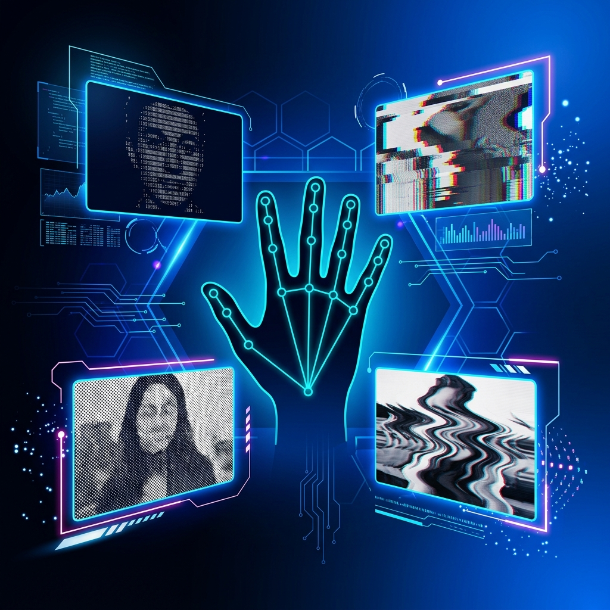

# GestureFilter v2 — Anti-Gravity UI

<p align="center">
  
</p>

## Overview

**GestureFilter** is a high-performance, **real-time webcam filter engine** built in React and WebGL. Powered by Google's **MediaPipe**, it features GPU-accelerated shader filters (Dither, Glitch, ASCII, Drunk), gesture-based number detection (1-10), and the modular Anti-Gravity UI architecture — all running at a stable **60 FPS** in the browser.

---

## Key Features

- **WebGL Shader Filters** — Dither, Glitch, ASCII, and Drunk effects at 60 FPS
- **MediaPipe Hand Tracking** — Runs in a Web Worker for zero main-thread blocking
- **Number Detection (1-10)** — Custom joint-tip heuristics for one/two-hand gestures
- **Hand Stabilizer** — Frame persistence algorithms to prevent tracking jitter
- **Anti-Gravity UI** — Minimal, zero-waste interface with toggle overlay
- **Edge-ready** — Optimized for Cloudflare Pages / Vercel deployment

---

## Technology Stack

| Technology | Purpose |
|---|---|
| React | UI framework |
| WebGL | GPU shader rendering |
| MediaPipe Vision | Hand tracking inference |
| Vite | Build tool |
| TypeScript | Type-safe codebase |
| Web Workers | Off-thread ML inference |
| Cloudflare Pages | Edge deployment |

---

## Architecture

```text
Webcam Feed
    ↓
Web Worker → MediaPipe Hand Detection
    ↓
Gesture Recognition + Hand Stabilizer
    ↓
WebGL Shader Pipeline (FilterBase)
    ↓
Real-time Canvas Output @ 60 FPS
```

---

## Installation & Setup

```bash
git clone https://github.com/srivatsacool/GestureFilter.git
cd GestureFilter
npm install
npm run dev
# Open http://localhost:5173
```

---

## Author

**Srivatsa Gorti**

---
